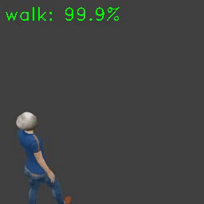

# video-classification-simulator
Video classification simulator by using [3D-ResNets-PyTorch][3d-resnets-pytorch].

 

[3d-resnets-pytorch]: https://github.com/kenshohara/3D-ResNets-PyTorch


## Requirements
- Python 3.x
- PyTorch 1.x
- Blender 2.79b
- FFmpeg
- GNU Bash 4.x


## Installation
On Ubuntu 18.04

Clone [mogen][mogen] repository:

    $ git clone https://github.com/ishitsuka-hikaru/mogen.git
    
Clone [3D-ResNets-PyTorch for MakeHuman][3d-resnets-pytorch-makehuman] repository:

    $ git clone https://github.com/ishitsuka-hikaru/3D-ResNets-PyTorch.git
    
Each module installation and usage refere to their README.md.

Edit line-2, line-3 in run_sim.sh:

    sim.sh
    1  #!/bin/bash
    2  PATH_3D_RESNETS=<3D-ResNets-PyTorch repository>
    3  PATH_MOGEN=<mogen repository>
    4  ...

Download pre-train model from [here][makehuman-100k-pretrain] (AIST internal).  
This model is trained on Kinetics-700, and fine-tuned by MakeHuman-100k dataset. If you need Makehuman-100k dataset, you can download it [here][makehuman-100k-dataset] (AIST internal).

Make new directory and move to the model:

    $ mkdir -p data/models && mv <MakeHuman-100k-31.pth> data/models    

[mogen]: https://github.com/ishitsuka-hikaru/mogen
[3d-resnets-pytorch-makehuman]: https://github.com/ishitsuka-hikaru/3D-ResNets-PyTorch
[makehuman-100k-pretrain]: https://aistmail-my.sharepoint.com/:u:/g/personal/ishitsuka_hikaru_aist_go_jp/EQfx3gQlaVREpqPcj0b_DyMBouq0d-57N6QKxQyzI4sBkQ?e=9PPLUE
[makehuman-100k-dataset]: https://aistmail-my.sharepoint.com/:u:/g/personal/ishitsuka_hikaru_aist_go_jp/EaYl2B5yueFAgC2X_LS7Jm0B5lTU1ivjsvB2nAsFM-0khg?e=5gnpeQ


# Usage
## Demo

Show help:

```
$ ./run_sim.sh -h
Usage: run_sim.sh [OPTION]...

	-m, --model              string   Specify model ID (f00|...|f04|m00|...|m04), default f00
	-l, --label              string   Specify motion label (walk|run|jump|...), default walk
	--camera_angle           int      Specify camera angle (1|2|3|4), default 1
	--cam_x                  float    Specify camera location x, default 0
	--cam_y                  float    Specify camera location y, default 0
	--cam_z                  float    Specify camera location z, default 0
	-a, --averaging                   Averaging per video, default false
	-c, --camera_constraint  string   Active camera control (none|track_to|copy_location), default none
	-s, --seed               int      Random seed for the label selection, default 0
	--floor_texture          string   Add floor texture, default none
	--show_labels                     Show all ground-truth class labels
	-q, --quiet                       Quiet
	-h, --help                        Help
```

Run simulation:

    $ ./run_sim.sh -m f00 -l walk 
    
where "f00" is MakeHuman model name (female-00), "walk" is ground-truth video label.

Result is here by default:

    $ ls data/mp4/
    f00-107_03-loc3.0_-3.0_3.0-rot60_0_45-end102_walk.mp4
    $ ls data/results/
    opts.json  test_no_average.json


## Sweep mode
Visualize 3D-ResNets score on a hemisphere (see [tutorial/sweep_data_analysis.ipynb][tutorial]).

```
$ ./sweep.sh -h
Usage: sweep.sh.tmp4 [OPTION]...

    -m, --model                 string  Specify model ID (f00|...|f04|m00|...|m04)
    -l, --label                 string  Specify motion label (walk|run|jump|...), see utils/mocap_labels.json
    --r_min                     float   Minimum radius (meters), default 10
    --r_max                     float   Maximum radius (meters), default 10
    --r_step                    float   Radius step (meters), default 1
    --r_fixed                   float   Fixed radius (meters)
    --lon_min                   float   Minimum longitude (degrees), default 0
    --lon_max                   float   Maximum longitude (degrees), default 360
    --lon_step                  float   Longitude step (degrees), default 1
    --lat_min                   float   Minimum latitude (degrees), default 0
    --lat_max                   float   Maximum latitude (degrees), default 90
    --lat_step                  float   Latitude step (degrees), default 1
    --lat_fixed                 float   Fixed latitude (degrees)
    -c, --camera_constraint     string  Active camera control (none|track_to|copy_location|track_and_copy), default none
    -s, --seed                  int     Random seed for the label selection
    -r, --retry                 int     Number of retry, default 10
    -v, --verbose                       Show blender stdout/stderr
    -g, --gen_sample                    Generate sample animation, not eval
    -h, --help                          Help
```

[tutorial]: tutorial/sweep_data_analysis.ipynb

    
# Reference
- <https://github.com/kenshohara/3D-ResNets-PyTorch>
